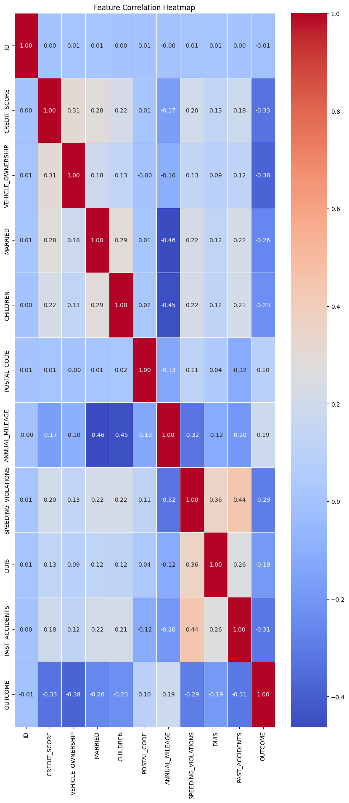
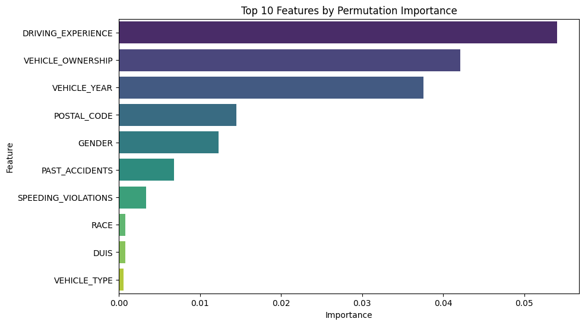

# 🧠 Car Insurance Claim Prediction: Exploratory Analysis and Machine Learning

This project presents a data science pipeline that aims to predict the likelihood of car insurance claims using machine learning techniques. It includes comprehensive steps such as data cleaning, exploratory analysis, feature engineering, model training, and evaluation.

---

## 📂 Dataset Overview

The dataset contains customer demographics, driving history, vehicle characteristics, and past claim data. The main target is the `OUTCOME` column, where:
- `0` = No claim filed
- `1` = Claim filed

---

## 🔍 Exploratory Data Analysis (EDA)

### 🔗 Correlation Heatmap

A correlation heatmap was generated to visualize how features relate to each other and to the target variable `OUTCOME`. Key takeaways:

- **Negatively correlated with OUTCOME**:
  - `VEHICLE_OWNERSHIP` (-0.38)
  - `CREDIT_SCORE` (-0.33)
  - `PAST_ACCIDENTS` (-0.31)
  - `SPEEDING_VIOLATIONS` (-0.29)

These features are considered impactful for prediction modeling.

---

## 💡 Feature Importance

Feature importance was assessed using permutation importance to identify which attributes most influence the prediction. The top 10 features are:

1. `DRIVING_EXPERIENCE`
2. `VEHICLE_OWNERSHIP`
3. `VEHICLE_YEAR`
4. `POSTAL_CODE`
5. `GENDER`
6. `PAST_ACCIDENTS`
7. `SPEEDING_VIOLATIONS`
8. `RACE`
9. `DUIS`
10. `VEHICLE_TYPE`

These were prioritized during model training and evaluation.

---

## 🤖 Model Training & Evaluation

A classification model was built using the most important features. Below are the performance metrics on the test data:

| Metric        | Class 0 (No Claim) | Class 1 (Claim) |
|---------------|-------------------|-----------------|
| Precision     | 0.86              | 0.76            |
| Recall        | 0.90              | 0.67            |
| F1-Score      | 0.88              | 0.71            |
| **Accuracy**  | **0.83** (overall) |                 |

- The model is particularly effective at identifying customers unlikely to file claims.
- Recall for claim cases can be further improved through class rebalancing or threshold tuning.

---

## ✅ Key Insights

- Features like driving experience, vehicle year, and ownership status play a vital role in risk prediction.
- Model performance is strong, with over **83% accuracy**, though precision-recall balance for claimers (minority class) should be optimized.
- Future improvements may include:
  - Addressing class imbalance (e.g., using SMOTE)
  - Testing ensemble models (Random Forest, XGBoost, LightGBM)
  - Feature interaction exploration
  - Hyperparameter optimization

---

For further information:  
📧 Contact: bara-hakawati@hotmail.com 
📂 Full Analysis: [Retail_Sales_Prediction.ipynb](Car_Insurance_Claim_Analysis.ipynb)  
